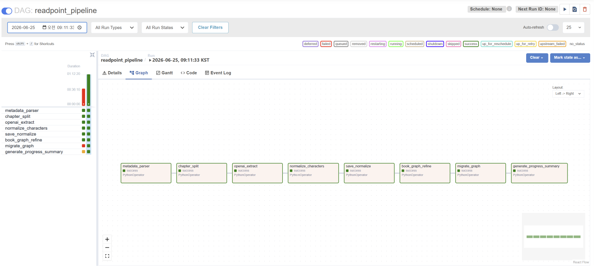

# readpoint-airflow

> Readpoint ADF 파이프라인을 Apache Airflow DAG로 재설계한 개인 실습 레포지토리

---

## 개요

[Readpoint](https://github.com/bagg8234-lab/Readpoint) 프로젝트에서 Azure Data Factory로 구현한 데이터 파이프라인을 Apache Airflow DAG로 재설계했습니다.

ADF의 한계였던 **파이프라인 단위 재실행** 문제를 Airflow의 **태스크 단위 재실행**으로 개선하는 것이 목적입니다.

| 항목 | ADF | Airflow |
|---|---|---|
| 재실행 단위 | 파이프라인 전체 | 실패 태스크만 |
| 의존성 관리 | ForEach 중첩 | XCom 기반 태스크 간 데이터 전달 |
| 모니터링 | Azure Monitor | Airflow UI (Graph / Gantt) |
| 로컬 테스트 | 불가 | Docker Compose로 가능 |

자세한 전환 과정은 [Velog 시리즈](https://velog.io/@rldnjs0906/series/Azure-Data-Factory-%EC%93%B0%EA%B3%A0-Airflow%EB%A1%9C-%EB%84%98%EC%96%B4%EA%B0%84-%EC%9D%B4%EC%9C%A0)를 참고해주세요.

---

## 파이프라인 구조

```
metadata_parser
→ chapter_split
→ openai_extract_chapter     # 챕터별 GPT 추출
→ normalize_characters
→ save_normalized_analysis
→ book_graph_refine
→ migrate_graph
→ generate_progress_summary_event
```

### DAG 실행 결과



---

## 기술 스택

| 항목 | 내용 |
|---|---|
| Orchestration | Apache Airflow 2.10.5 |
| 실행 환경 | Docker + SequentialExecutor |
| DB | SQLite (로컬 테스트용) |
| Pipeline | Azure Functions, PostgreSQL, Neo4j |

---

## 트러블슈팅

### 1. JSONDecodeError 반복 발생

**문제** ADF에서 정상 처리된 EPUB 파일이 Airflow DAG에서 JSONDecodeError로 반복 실패

**원인** 특정 EPUB 파일의 챕터 구조가 GPT 응답 파싱 과정에서 예외 케이스로 처리됨

**해결** 다른 EPUB 파일로 교체 후 재실행 → 전 구간 성공 확인. 해당 파일은 전처리 단계 예외 처리 로직 추가로 대응

---

### 2. ADF ForEach Content Filter 오류

**문제** ADF ForEach 병렬 처리 중 일부 챕터에서 Azure OpenAI Content Filter 오류 발생

**원인** 무제한 병렬 처리 시 Rate Limit 초과 및 필터 트리거

**해결** Batch Count를 3으로 제한 → 실패율 0% 달성

---

## 환경 설정

### 1. 레포 클론

```bash
git clone https://github.com/bagg8234-lab/readpoint-airflow.git
cd readpoint-airflow
```

### 2. .env 파일 생성

```bash
cp .env.example .env
```

`.env` 파일에 실제 값 입력:

```
AZURE_FUNCTIONS_URL=https://your-functions-url
AZURE_FUNCTIONS_KEY=your-key
AZURE_FUNCTIONS_URL_META=https://your-meta-functions-url
AZURE_FUNCTIONS_KEY_META=your-meta-key
PG_HOST=your-pg-host
PG_DATABASE=your-db-name
PG_USER=your-user
PG_PASSWORD=your-password
```

### 3. airflow.db 파일 생성

```powershell
# Windows PowerShell
New-Item -Path ./airflow.db -ItemType File
```

### 4. 실행

```bash
docker-compose up
```

### 5. Airflow UI 접속

```
http://localhost:8080
```

초기 비밀번호 확인:

```bash
docker logs airflow-test-airflow-1 2>&1 | findstr password
```

---

## DAG 트리거

Airflow UI에서 `readpoint_pipeline` DAG 선택 후 트리거 시 다음 값 입력:

```json
{
  "file_url": "https://your-storage/epub/book.epub",
  "admin_id": "1"
}
```

---

## 관련 링크

- [Readpoint 프로젝트](https://github.com/bagg8234-lab/Readpoint) (개인 레포)
- [Readpoint 원본 프로젝트](https://github.com/3dt-3rd-project-org) (팀 레포)
- [Velog 시리즈 - ADF에서 Airflow로](https://velog.io/@rldnjs0906/series/Azure-Data-Factory-%EC%93%B0%EA%B3%A0-Airflow%EB%A1%9C-%EB%84%98%EC%96%B4%EA%B0%84-%EC%9D%B4%EC%9C%A0)
